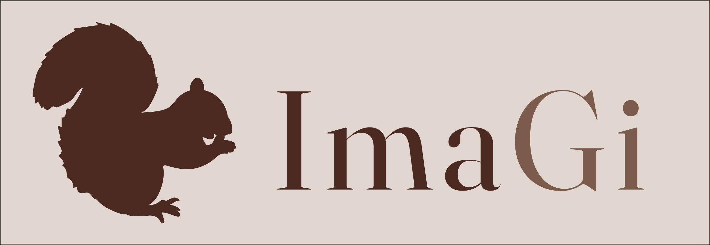
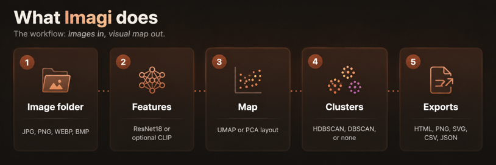
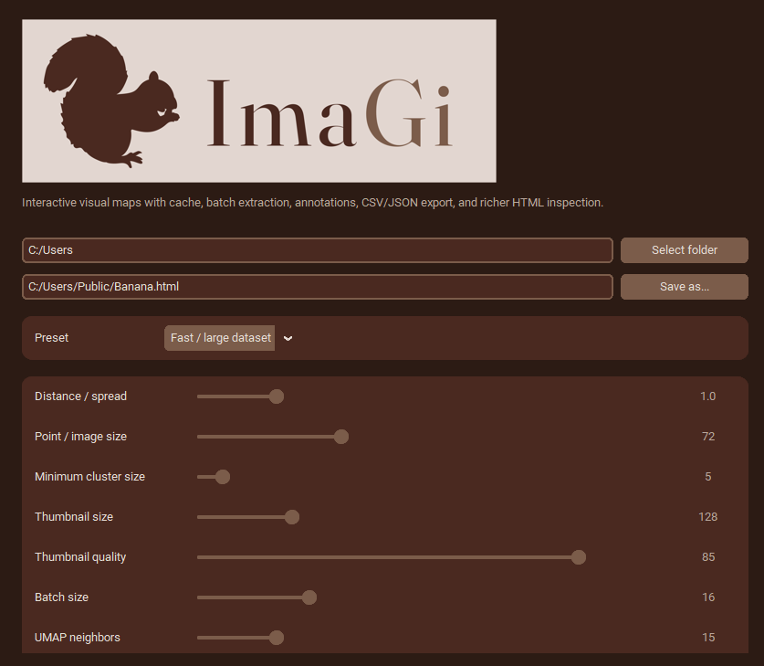
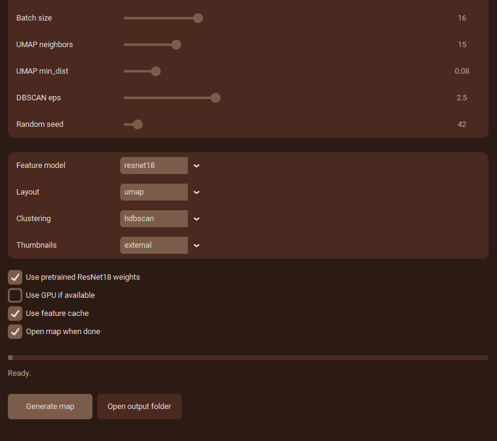

<p align="center">
  
</p>
<p align="center">
  <a href="https://scholar.google.com/citations?user=CoxLqv0AAAAJ&hl=en&oi=ao">Giulia Giorgi</a>
  and
  <a href="https://scholar.google.com/citations?user=fLxWxDgAAAAJ&hl=en&oi=ao">Luca Giuffré</a>
 

</p>

<p align="center">
  <a href="#what-it-is">What it is</a> &middot;
  <a href="#install">Install</a> &middot;
  <a href="#how-it-works">How it works</a> &middot;
  <a href="#usage">Usage</a>
</p>

---

# What it is

ImaGi is a desktop tool that loads images from folders, extracts features using ResNet18 or CLIP, reduces dimensionality with UMAP or PCA, and clusters results. It enables exploratory analysis of visual datasets, creating interactive maps, annotations, and exportable outputs for research and organization. Designed for fast, flexible visual data understanding.

# Install
Recommended installation using Windows and Anaconda

```bash
# Create and activate a new environment with Python 3.11
conda create -n imagemap python=3.11 -y
conda activate imagemap
# Set directory
cd C:\Users\banana\
```
Clone the repository
```bash
git clone https://github.com/Giuliagiorgi/ImaGi.git
```

Install required packages

```bash
pip install -r requirements.txt
```
> Full list of required packages at **requirements.txt**, main folder.

Then, run

```bash
python Imagi.py
```

# How it works
<p align="center">
  
</p>

ImaGi turns a folder of images into a visual map for exploration and grouping. It first converts each image into a numerical feature vector, then reduces those vectors into a 2D layout, and finally applies clustering to identify related images.

## 1. Feature extraction
Each image is transformed into a feature representation that captures its visual content. These vectors make it possible to compare images computationally and estimate similarity across the dataset.

ImaGi supports two extraction models:
- **ResNet18**: default option, fast, stable, and well suited to visual similarity.
- **CLIP**: optional, heavier, and better for semantic similarity.
> Recommended settings:
> - Use pretrained **REsNet18 weights** for better results.
> - Use **GPU** if available for faster processing

## 2. Layout generation

After feature extraction, ImaGi projects the images onto a two-dimensional map. This step controls how the dataset is displayed for exploration.

Available layout methods:

- **PCA**: faster and more stable; useful for quick tests, large datasets, or troubleshooting.
- **UMAP**: better for exploratory analysis; tends to keep similar images closer and create more readable clusters or “islands.”

### UMAP parameters

- **Neighbors**: controls the scale of comparison. Lower values emphasize local groups; higher values show broader structure.
- **Min dist**: controls how compact the groups are. Lower values create tighter clusters; higher values spread them out.

### Spacing controls

- **Distance / spread**: affects only the visual layout, making the map more compact or more open without changing the underlying similarities.

## 3. Clustering

Once the map is built, ImaGi groups similar images using clustering methods.

Supported options

- **HDBSCAN**: good for discovering dense groups automatically.
- **DBSCAN**: useful for density-based clustering with simpler control.
- **None**: disables automatic clustering for manual inspection.

## 4. Output
The final result is an interactive visual map of the image collection, with clusters that help users explore patterns, similarities, and anomalies.

# Usage
<p align="center">
  
</p>
<p align="center">
  
</p>

1. Click `Select folder`.
2. Choose a folder containing images.
3. Choose a preset or adjust parameters manually.
4. Click `Generate map`.
5. The app saves an HTML file and opens it in your browser.
6. Use the HTML controls to inspect, annotate, filter, select and export.

## Recommended settings

For large datasets, use:

- preset: `Fast / large dataset`
- layout: `pca` or UMAP with smaller thumbnails
- thumbnails: `external`
- cache: on

For presentation exports, use:

- preset: `Presentation export`
- thumbnails: `embedded` if you want a single portable HTML file
- larger point/image size

For semantic exploration of AI images, use:

- preset: `Experimental / semantic`
- model: `clip`
- layout: `umap`

## Output files

If the output path is:

```txt
output/image_map.html
```

ImaGi also creates:

```txt
output/image_map.data.csv
output/image_map.data.json
output/thumbnails/
output/.image_map_cache/
```

The `thumbnails/` folder is needed only when using external thumbnails. Keep it next to the HTML file.

## Notes

- ResNet18 remains the most reliable default because it has fewer installation requirements.
- CLIP requires `open-clip-torch` and may need to download weights.
- HDBSCAN is optional. If missing, the app falls back to DBSCAN.
- Annotations made in the HTML are stored in the browser's localStorage. Use `export csv` or `export json` inside the HTML to save them permanently.
